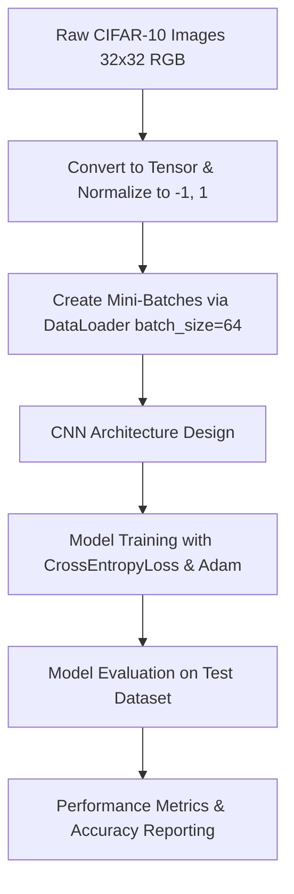

# 🖼️ VisionNet: Classifying CIFAR-10 Images with Convolutional Neural Networks

[](https://www.python.org/)
[](https://pytorch.org/)
[](https://pytorch.org/vision/)
[](https://opensource.org/licenses/MIT)

An end-to-end deep learning project built to classify images into 10 distinct categories using the CIFAR-10 dataset. I designed, built, and trained a PyTorch-based Convolutional Neural Network (CNN) that achieves **75.65% accuracy** on unseen test data—demonstrating spatial feature extraction, image preprocessing, and deep learning pipeline design.

---

## 🔍 The Pipeline & Modeling Workflow

The project follows a standard PyTorch computer vision workflow, from image preprocessing to testing. Here is the general structure:



### Behind the Scenes: How the Pipeline is Built

To get the raw image pixel data ready for the convolutional layers, I built a structured PyTorch preprocessing pipeline:

- **Normalizing pixel values**: The raw images are 32x32 pixels with 3 color channels (RGB) and pixel values ranging from 0 to 255. I used `transforms.ToTensor()` to scale these pixel values to `[0, 1]`, and then applied `transforms.Normalize((0.5, 0.5, 0.5), (0.5, 0.5, 0.5))` to scale them to the range `[-1, 1]`. This centering and scaling step prevents exploding/vanishing gradients and helps the neural network converge much faster during backpropagation.
- **Loading and Batching**: Because we can't fit the entire dataset of 50,000 training images into memory at once, I wrapped the datasets in PyTorch `DataLoader` objects. I set the batch size to `64` and enabled shuffling on the training set to ensure the network doesn't memorize the order of the images.

---

## 🏗️ Neural Network Architecture & Training

I built a Convolutional Neural Network (CNN) using PyTorch's `nn.Module` with the following layers:

- **Convolutional Block 1**: Accepts the 3-channel RGB image. It has a `Conv2d` layer (32 output channels, 3x3 kernel, padding of 1 to preserve dimensions), a `ReLU` activation, and a `MaxPool2d` layer (2x2 kernel, stride of 2) which downsamples the feature map from 32x32 to 16x16.
- **Convolutional Block 2**: A `Conv2d` layer (32 to 64 channels, 3x3 kernel, padding of 1), a `ReLU` activation, and a `MaxPool2d` layer that downsamples the feature map from 16x16 to 8x8.
- **Convolutional Block 3**: A `Conv2d` layer (64 to 128 channels, 3x3 kernel, padding of 1), a `ReLU` activation, and a `MaxPool2d` layer that downsamples the final spatial dimensions to 4x4.
- **Fully Connected (FC) Block**: I flattened the 128 channels of 4x4 feature maps into a single 2,048-dimensional vector. Then, I passed it through a linear layer mapping to 256 nodes (with a `ReLU` activation) and a final linear layer mapping to the 10 outputs corresponding to the logits for each CIFAR-10 class.

I compiled the model using `CrossEntropyLoss` to measure classification error and the `Adam` optimizer to update the network weights.

---

## 📊 Model Evaluation & Results

Here are the training and testing metrics I recorded from the model run:

### Training Loss Progression

During training, I ran the optimization loop for **10 epochs**. The average training loss per batch steadily converged:

| Epoch        | Training Loss (Average per Batch) |
| :----------- | :-------------------------------: |
| **Epoch 1**  |              1.3829               |
| **Epoch 2**  |              0.9521               |
| **Epoch 3**  |              0.7685               |
| **Epoch 4**  |              0.6334               |
| **Epoch 5**  |              0.5282               |
| **Epoch 6**  |              0.4334               |
| **Epoch 7**  |              0.3466               |
| **Epoch 8**  |              0.2737               |
| **Epoch 9**  |              0.2112               |
| **Epoch 10** |            **0.1660**             |

### Testing Results (Unseen Data)

- **Total Samples Evaluated**: 10,000
- **Correct Predictions**: 7,565
- **Accuracy Score**: **75.65%**

### 💡 What the numbers tell us

- **Spatial features are key**: A test accuracy of **75.65%** is a very strong baseline result for a simple 3-layer CNN. Since a random guess on 10 classes yields only 10% accuracy, this shows the network successfully learned to recognize distinctive spatial features (like wheels on cars, wings on planes, or ears on cats).
- **Clear Convergence**: The training loss dropped smoothly from 1.3829 down to 0.1660, confirming that the Adam optimizer worked perfectly to minimize our cross-entropy loss.
- **Addressing Overfitting**: While the training loss dropped all the way to 0.1660, our testing accuracy leveled out at 75.65%. This gap indicates that the model is beginning to overfit the training dataset (memorizing specific details of the training set rather than learning generic patterns). Adding regularization would be the next step to close this gap.

---

## 🚀 Next Steps: How I'd Take This Further

If I had more time or were preparing this model for a production computer vision pipeline, here are the 5 strategies I would implement to push performance even higher:

1. **Add Data Augmentation**: Currently, the model sees the exact same training images every epoch. I would introduce random horizontal flips, cropping, and rotations (`transforms.RandomHorizontalFlip`, `transforms.RandomCrop`) to the training pipeline. This artificially increases dataset diversity and teaches the model to be invariant to object position and orientation.
2. **Implement Dropout and Batch Normalization**: To combat the overfitting, I'd add `nn.Dropout(p=0.3)` layers after our dense layer and add `nn.BatchNorm2d` after each convolutional layer. Batch normalization stabilizes training and allows for higher learning rates, while dropout forces the network to learn robust, redundant representations.
3. **Use a Learning Rate Scheduler**: A fixed learning rate of 0.001 can sometimes cause the weights to bounce around local minima late in training. I would add a scheduler like `ReduceLROnPlateau` or `CosineAnnealingLR` to decay the learning rate when validation loss plateaus, allowing the network to settle smoothly into a global minimum.
4. **Leverage Transfer Learning (Pre-trained Models)**: Building a CNN from scratch is a great exercise, but pre-trained networks like **ResNet-18** or **VGG-16** (trained on ImageNet) have already learned millions of visual features. Fine-tuning one of these models on CIFAR-10 would easily boost our test accuracy past 90%.
5. **Set aside a Validation Set and Use Early Stopping**: Currently, we evaluate directly on the test set. I'd split the training set to hold out 10% of the images as a validation split. By monitoring validation loss during training, I could save the model checkpoint only when validation performance improves, preventing overfitting at the final epoch.

---

## 🛠️ How to Run the Project Locally

If you want to run the notebook on your local machine, here is the quick-start guide:

### 1. Clone and Navigate

```bash
git clone <repository-url>
cd Convolutional_Neural_Networks-Image_Classification
```

### 2. Spin Up a Virtual Environment

- **On Windows (PowerShell):**
  ```powershell
  python -m venv .venv
  .venv\Scripts\Activate.ps1
  ```
- **On macOS/Linux:**
  ```bash
  python3 -m venv .venv
  source .venv/bin/activate
  ```

### 3. Install the Packages

```bash
pip install torch torchvision ipykernel
```

_(Note: The CIFAR-10 dataset files are already stored locally in the `data/` directory, so running the notebook will verify the files and start training immediately without waiting for a large download.)_

### 4. Open and Run the Notebook

Open `CNN_Classification.ipynb` in your IDE (like VS Code), select the `.venv` environment as your python interpreter/kernel, and run all cells to see the training loop and evaluation in action.
