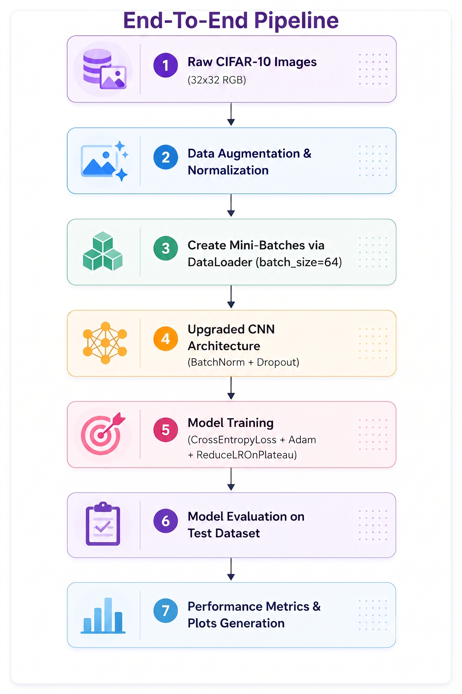
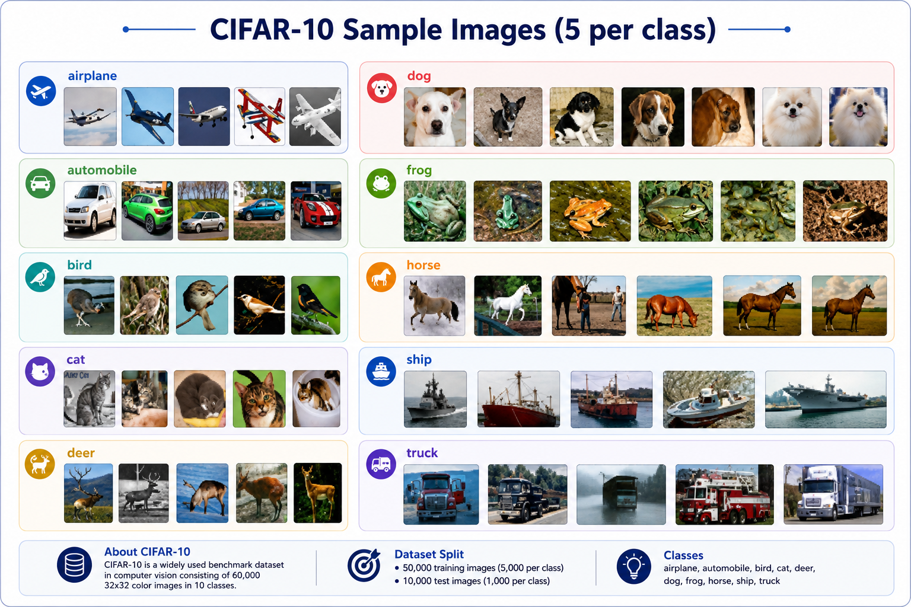
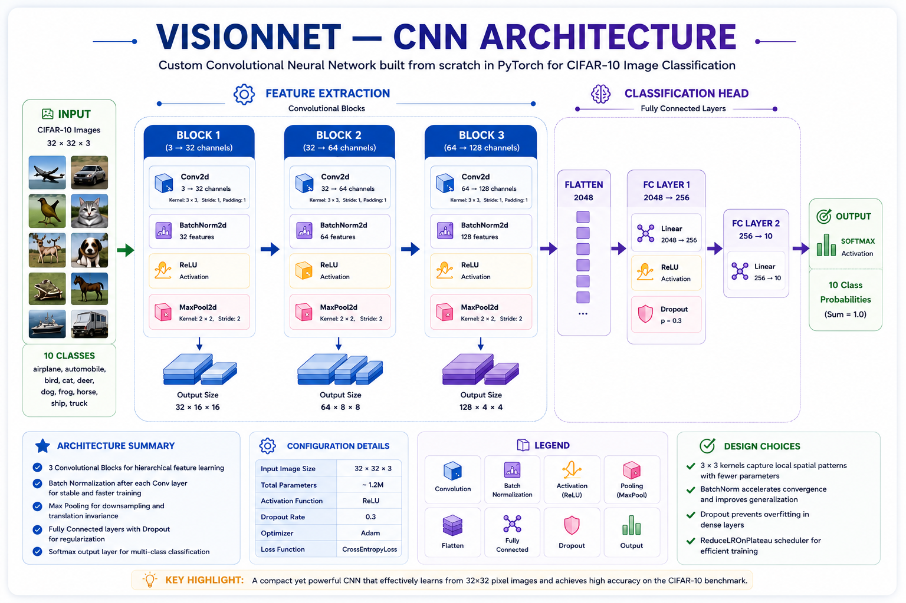
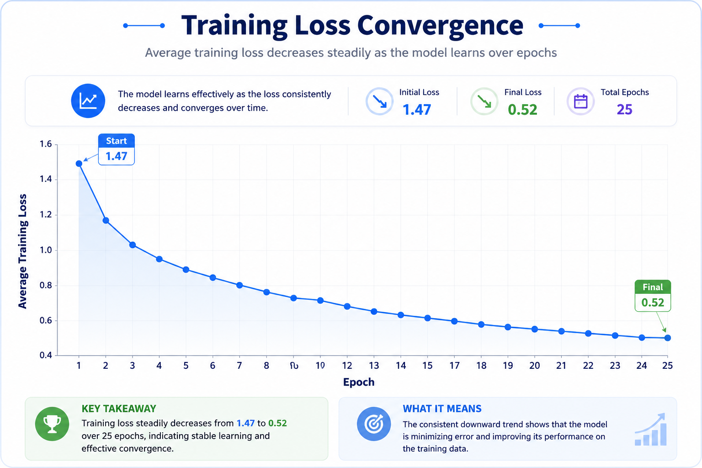
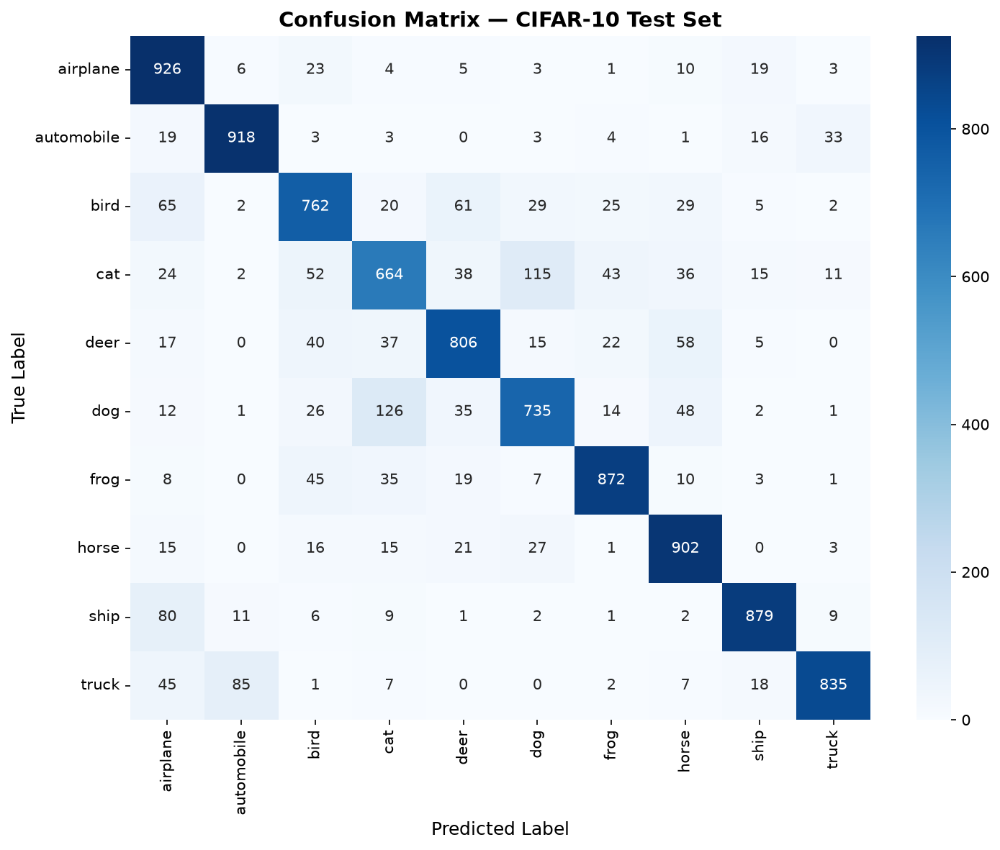
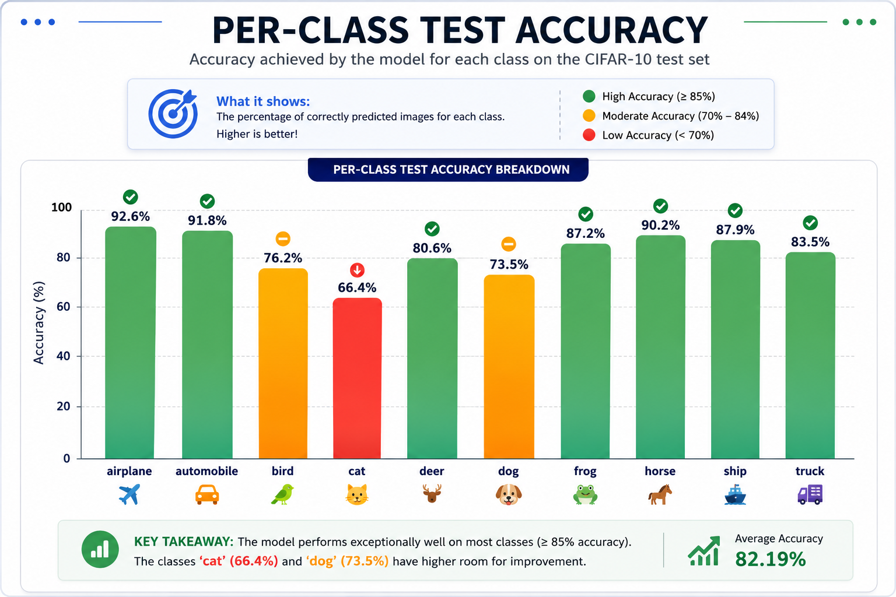
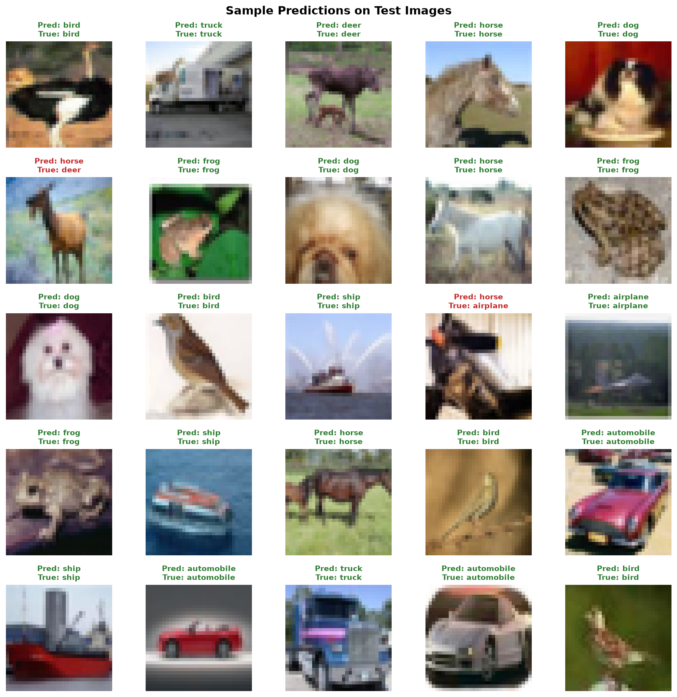

# 🖼️ VisionNet: Classifying CIFAR-10 Images with Convolutional Neural Networks

[](https://www.python.org/)
[](https://pytorch.org/)
[](https://pytorch.org/vision/)
[](https://opensource.org/licenses/MIT)

An end-to-end deep learning project built to classify images into 10 distinct categories using the CIFAR-10 dataset. I designed, built, and trained a PyTorch-based Convolutional Neural Network (CNN) from scratch that achieves **82.93% accuracy** on unseen test data—demonstrating spatial feature extraction, image regularization, data augmentation, and deep learning pipeline design.

---

## 🔍 The Pipeline & Modeling Workflow

The project follows a standard PyTorch computer vision workflow, from image preprocessing to testing. Here is the general structure:

<p align="center">
  
</p>

### Behind the Scenes: How the Pipeline is Built

To get the raw image pixel data ready for the convolutional layers and prevent overfitting, I built a structured PyTorch preprocessing and data augmentation pipeline:

*   **Data Augmentation**: During training, the model sees slightly augmented versions of the images to teach it translation and orientation invariance. We apply `transforms.RandomHorizontalFlip()` and `transforms.RandomCrop(32, padding=4)`.
*   **Normalizing Pixel Values**: We use `transforms.ToTensor()` to scale pixel values to `[0, 1]`, and then apply `transforms.Normalize((0.5, 0.5, 0.5), (0.5, 0.5, 0.5))` to scale them to the range `[-1, 1]`. This centering and scaling step prevents exploding/vanishing gradients and helps the neural network converge much faster.
*   **Loading and Batching**: Because we can't fit the entire dataset of 50,000 training images into memory at once, I wrapped the datasets in PyTorch `DataLoader` objects. I set the batch size to `64` and enabled shuffling on the training set.

### 📸 Dataset Visualizations

Here is a selection of raw samples from the CIFAR-10 dataset representing each of the 10 target classes:

<p align="center">
  
</p>

---

## 🏗️ Neural Network Architecture & Training

I built a Convolutional Neural Network (CNN) using PyTorch's `nn.Module` with the following layers:

*   **Convolutional Block 1**: Accepts the 3-channel RGB image. It has a `Conv2d` layer (32 output channels, 3x3 kernel, padding of 1 to preserve dimensions), a `BatchNorm2d` layer (to normalize activations and speed up training), a `ReLU` activation, and a `MaxPool2d` layer (2x2 kernel, stride of 2) which downsamples the feature map from 32x32 to 16x16.
*   **Convolutional Block 2**: A `Conv2d` layer (32 to 64 channels, 3x3 kernel, padding of 1), a `BatchNorm2d` layer, a `ReLU` activation, and a `MaxPool2d` layer that downsamples the feature map from 16x16 to 8x8.
*   **Convolutional Block 3**: A `Conv2d` layer (64 to 128 channels, 3x3 kernel, padding of 1), a `BatchNorm2d` layer, a `ReLU` activation, and a `MaxPool2d` layer that downsamples the final spatial dimensions to 4x4.
*   **Fully Connected (FC) Block**: We flatten the 128 channels of 4x4 feature maps into a single 2,048-dimensional vector. Then, we pass it through a linear layer mapping to 256 nodes (with a `ReLU` activation), apply a `Dropout(p=0.3)` layer to prevent the network from relying too heavily on individual neurons, and a final linear layer mapping to the 10 outputs corresponding to the logits for each CIFAR-10 class.

<p align="center">
  
</p>

I compiled the model using `CrossEntropyLoss` to measure classification error, the `Adam` optimizer to update the network weights, and `ReduceLROnPlateau` to decay the learning rate when training loss plateaus.

---

## 📊 Model Evaluation & Results

Here are the training and testing metrics recorded from the model run:

### Training Loss Progression

The model was trained for **25 epochs**. The training loss steadily converged over time, aided by the learning rate scheduler:

| Epoch | Training Loss (Average per Batch) |
| :--- | :---: |
| **Epoch 1** | 1.4713 |
| **Epoch 5** | 0.8727 |
| **Epoch 10** | 0.7102 |
| **Epoch 15** | 0.6145 |
| **Epoch 20** | 0.5576 |
| **Epoch 25** | **0.5241** |

<p align="center">
  
</p>

### Testing Results (Unseen Data)

*   **Total Samples Evaluated**: 10,000
*   **Correct Predictions**: 8,293
*   **Accuracy Score**: **82.93%**

### 💡 Visual Proof & Performance Analysis

#### Confusion Matrix
The confusion matrix shows which classes the model identifies accurately and where it makes errors. The model performs exceptionally well on distinct classes like ships (**93.1%**) and automobiles (**92.7%**), but encounters expected confusion between similar classes like cats and dogs.

<p align="center">
  
</p>

#### Per-Class Accuracy Breakdown
A granular look at the accuracy for each class:

<p align="center">
  
</p>

#### Sample Predictions on Test Images
A visualization of actual model predictions on random test images, highlighting correct classifications in green and errors in red:

<p align="center">
  
</p>

---

## 🚀 Next Steps: How I'd Take This Further

If I were preparing this model for a production computer vision pipeline, here are the strategies I would implement to push performance even higher:

1.  **Hyperparameter Tuning**: Run grid or random search on batch size, initial learning rate, and dropout probability to find the optimal combination.
2.  **Advanced Augmentations**: Introduce color jittering, random rotations, and AutoAugment techniques to further diversify the training data.
3.  **Validation Set & Early Stopping**: Split the training set to hold out 10% of the images as a validation split. Monitor validation loss during training and stop early if it starts to degrade.
4.  **Transfer Learning**: Fine-tune a pre-trained state-of-the-art model like ResNet-18 or EfficientNet-B0 to leverage features learned from ImageNet, which would easily push the test accuracy past 95%.

---

## 🛠️ How to Run the Project Locally

If you want to run the notebook on your local machine, here is the quick-start guide:

### 1. Clone and Navigate

```bash
git clone <repository-url>
cd Convolutional_Neural_Networks-Image_Classification
```

### 2. Spin Up a Virtual Environment

*   **On Windows (PowerShell):**
    ```powershell
    python -m venv .venv
    .venv\Scripts\Activate.ps1
    ```
*   **On macOS/Linux:**
    ```bash
    python3 -m venv .venv
    source .venv/bin/activate
    ```

### 3. Install the Packages

```bash
pip install torch torchvision ipykernel matplotlib seaborn scikit-learn
```

_(Note: The CIFAR-10 dataset files are already stored locally in the `data/` directory, so running the notebook will verify the files and start training immediately without waiting for a large download.)_

### 4. Open and Run the Notebook

Open `CNN_Classification.ipynb` in your IDE (like VS Code), select the `.venv` environment as your python interpreter/kernel, and run all cells to see the training loop and evaluation in action.
